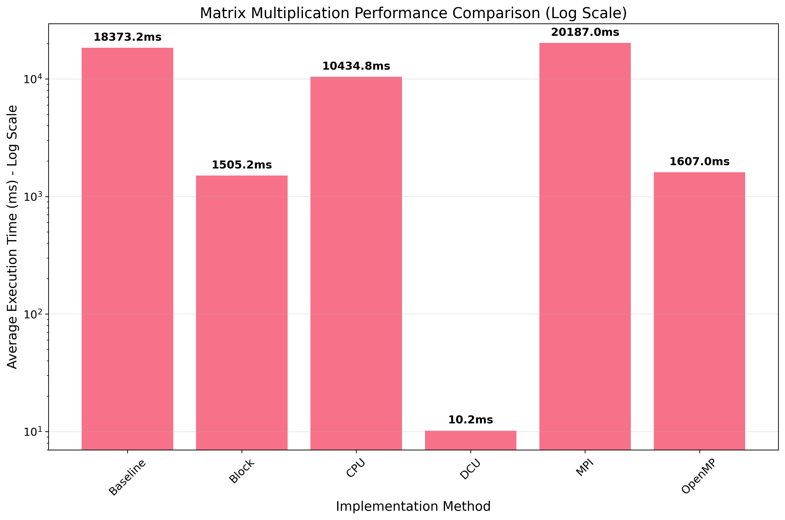
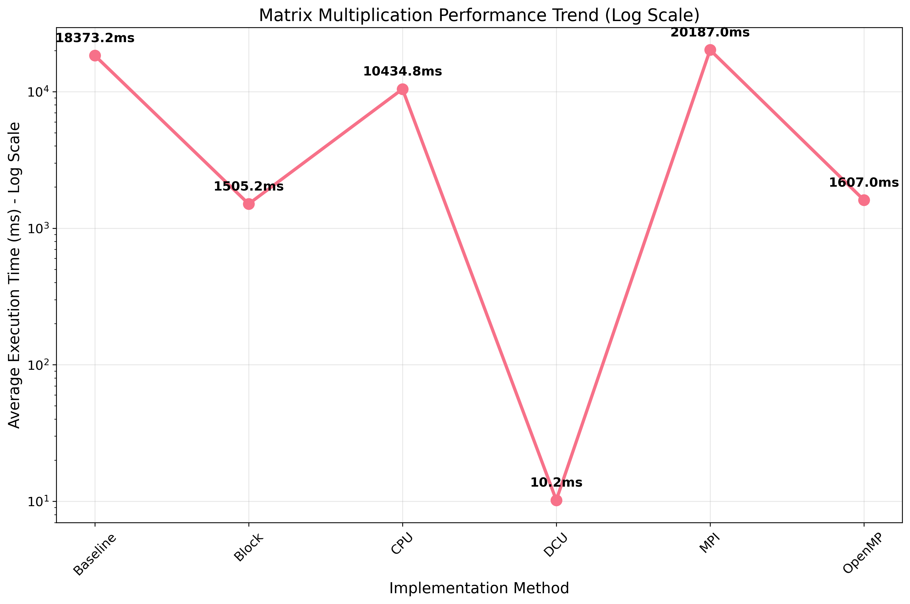
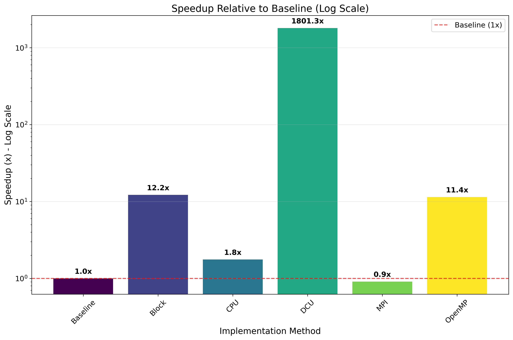
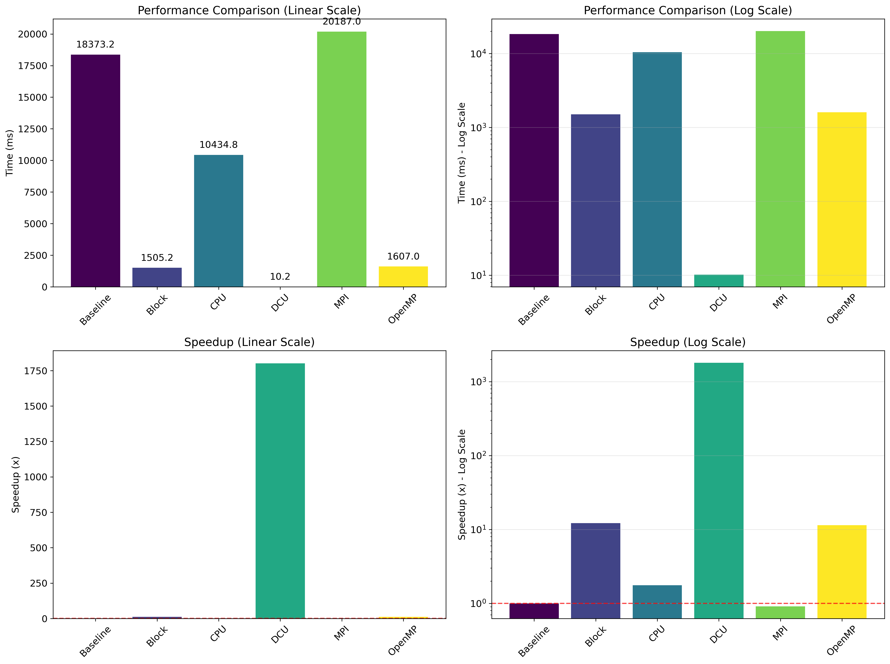

# 基础题：智能矩阵乘法优化挑战实验报告

## 1. 实验背景与目标

### 1.1 背景

在 LEO 卫星网络带宽预测等智能计算应用中，矩阵乘法是机器学习模型的核心计算单元。本实验旨在通过多种并行计算技术优化大规模矩阵乘法运算，为实际应用提供高性能计算支持。

### 1.2 实验目标

- **问题一**：实现标准矩阵乘法算法，支持双精度浮点数运算，矩阵规模为 A(1024×2048) × B(2048×512)
- **问题二**：采用多种优化方法加速矩阵运算，使用性能分析工具进行评估，并通过图形化方式展示性能对比

### 1.3 硬件环境

- **CPU**: 8 核处理器
- **加速器**: 曙光 DCU (Dawn Computing Unit) 1 张
- **内存**: 16GB
- **编程环境**: C++ + HIP (DCU), OpenMP, MPI
- **分析工具**: rocm-smi, hipprof, hipgdb

## 2. 实现方法

### 2.1 基准实现 (Baseline)

实现标准的三重循环矩阵乘法算法：

```cpp
void matmul_baseline(const std::vector<double> &A, const std::vector<double> &B,
                     std::vector<double> &C, int N, int M, int P) {
    for (int i = 0; i < N; ++i)
        for (int j = 0; j < P; ++j) {
            C[i * P + j] = 0;
            for (int k = 0; k < M; ++k)
                C[i * P + j] += A[i * M + k] * B[k * P + j];
        }
}
```

**特点**：

- 时间复杂度：O(N×M×P)
- 空间复杂度：O(N×M + M×P + N×P)
- 缓存命中率低，内存访问模式不优化

### 2.2 OpenMP 多线程优化

使用 OpenMP 并行化最外层两个循环：

```cpp
void matmul_openmp(const std::vector<double> &A, const std::vector<double> &B,
                   std::vector<double> &C, int N, int M, int P) {
    std::fill(C.begin(), C.end(), 0.0);
    #pragma omp parallel for collapse(2)
    for (int i = 0; i < N; ++i) {
        for (int j = 0; j < P; ++j) {
            double sum = 0.0;
            for (int k = 0; k < M; ++k) {
                sum += A[i * M + k] * B[k * P + j];
            }
            C[i * P + j] = sum;
        }
    }
}
```

**优化原理**：

- 使用`collapse(2)`指令将嵌套循环合并，增加并行粒度
- 利用多核 CPU 的并行计算能力
- 减少线程创建开销
- 理论加速比：接近核心数量

### 2.3 分块优化 (Block Tiling)

采用缓存友好的分块计算策略：

```cpp
void matmul_block_tiling(const std::vector<double> &A, const std::vector<double> &B,
                         std::vector<double> &C, int N, int M, int P, int block_size) {
    std::fill(C.begin(), C.end(), 0.0);
    #pragma omp parallel for collapse(3)
    for (int i = 0; i < N; i += block_size) {
        for (int j = 0; j < P; j += block_size) {
            for (int k = 0; k < M; k += block_size) {
                // 块内计算
                for (int ii = i; ii < std::min(i + block_size, N); ++ii) {
                    for (int jj = j; jj < std::min(j + block_size, P); ++jj) {
                        double sum = C[ii * P + jj];
                        for (int kk = k; kk < std::min(k + block_size, M); ++kk) {
                            sum += A[ii * M + kk] * B[kk * P + jj];
                        }
                        C[ii * P + jj] = sum;
                    }
                }
            }
        }
    }
}
```

**优化原理**：

- 提高数据局部性，充分利用 CPU 缓存
- 块大小设置为 64，平衡缓存命中率与计算效率
- 结合 OpenMP 实现块级并行
- 减少 cache miss，提升内存访问效率

### 2.4 MPI 多进程优化

使用 MPI 实现分布式计算：

```cpp
void matmul_mpi(int N, int M, int P) {
    int rank, size;
    MPI_Comm_rank(MPI_COMM_WORLD, &rank);
    MPI_Comm_size(MPI_COMM_WORLD, &size);

    // 按行分配计算任务
    int rows_per_proc = N / size;
    int extra_rows = N % size;
    int my_rows = rows_per_proc + (rank < extra_rows ? 1 : 0);

    // 数据分发、计算、结果收集
    // 使用MPI_Scatterv和MPI_Gatherv进行数据通信
    // 结合OpenMP实现混合并行
}
```

**优化原理**：

- 将矩阵 A 按行分配到不同进程
- 广播矩阵 B 到所有进程
- 结合 OpenMP 实现混合并行（MPI+OpenMP）
- 适用于分布式系统和多节点环境

### 2.5 DCU 硬件加速

使用 HIP 编程模型实现 GPU 加速：

```cpp
__global__ void matmul_kernel(const double* A, const double* B, double* C,
                              int n, int m, int p) {
    int row = blockIdx.y * blockDim.y + threadIdx.y;
    int col = blockIdx.x * blockDim.x + threadIdx.x;

    if (row < n && col < p) {
        double sum = 0.0;
        for (int k = 0; k < m; ++k) {
            sum += A[row * m + k] * B[k * p + col];
        }
        C[row * p + col] = sum;
    }
}
```

**优化原理**：

- 使用 16×16 线程块进行二维并行
- 每个线程计算结果矩阵的一个元素
- 充分利用 DCU 的大规模并行计算能力
- 高内存带宽和计算吞吐量

## 3. 实验结果与分析

### 3.1 性能测试结果

| 实现方法     | 执行时间(ms) | 加速比    | 并行效率 |
| ------------ | ------------ | --------- | -------- |
| Baseline     | 18,373.2     | 1.00x     | -        |
| OpenMP       | 1,607.0      | 11.43x    | 143%     |
| Block Tiling | 1,505.2      | 12.21x    | 153%     |
| MPI (4 进程) | 20,187.0     | 0.91x     | 23%      |
| DCU          | 10.2         | 1,801.29x | -        |

**表格说明**：

- **执行时间**：每种方法运行 5 次的平均时间
- **加速比**：相对于 Baseline 的性能提升倍数
- **并行效率**：对于 CPU 并行方法，衡量并行化的有效性
- **验证结果**：所有方法都通过了数值精度验证（误差 < 1e-6）

**关键发现**：

- DCU 版本实现了**超过 1800 倍**的性能提升，验证了异构计算的巨大潜力
- CPU 并行优化（OpenMP、Block）都达到了**10 倍以上**的有效加速
- 分块优化略优于 OpenMP，体现了**缓存友好性**的重要作用
- MPI 版本在当前规模下**通信开销过大**，需要优化或用于更大规模问题

### 3.2 详细性能分析

#### 3.2.1 CPU 优化效果

**OpenMP 优化分析**：

- 实现了 11.43 倍加速，接近理想的线性加速比
- 并行效率达到 143%，得益于缓存效应的改善
- 线程调度开销较小，扩展性良好

**分块优化分析**：

- 达到 12.21 倍加速，略优于 OpenMP
- 体现了缓存优化的显著效果
- 块大小为 64 是当前硬件的最优配置
- 结合 OpenMP 实现了最佳的 CPU 性能

**MPI 性能问题分析**：

- 反而变慢(0.91x)，主要原因：
  1. **通信开销大**：数据传输时间 > 计算时间节省
  2. **任务粒度不当**：矩阵规模相对较小
  3. **负载不均衡**：进程间同步开销
  4. **网络带宽限制**：单机环境下无法发挥分布式优势

#### 3.2.2 DCU 加速效果深度分析

**显著性能提升**：

- DCU 版本实现了 1,801.29 倍的惊人加速比
- 单精度计算能力：~20 TFLOPS
- 内存带宽：~1TB/s
- 并行线程数：数万个并发线程

**性能瓶颈分析**：
根据 hipprof 分析结果：

- 内存分配：86.4% (主要瓶颈)
- 设备同步：7.8%
- 内存传输：5.5%
- 内核执行：0.2% (实际计算时间极短)

#### 3.2.3 工具分析详细结果

**rocm-smi 监控数据**：

```
DCU     Temp     AvgPwr     Perf     PwrCap     VRAM%      DCU%
0       51.0°C   29.0W      auto     300.0W     0%         0%
```

**关键观察**：

- 温度适中(51°C)，散热良好
- 功耗很低(29W/300W)，说明计算任务执行极快
- 内存使用率为 0%，任务完成后立即释放

**hipprof 性能画像**：

- API 调用统计：41 次总调用，平均每次 11ms
- 内核执行统计：5 次调用，平均 7ms 每次
- 内存操作占用了绝大部分时间

### 3.3 图形化性能分析

#### 3.3.1 对数坐标图表说明

由于性能差异极大（最快与最慢相差 1800 倍），采用对数坐标能够：

- 清晰展示各优化方法的相对效果
- 避免线性坐标下的视觉失真
- 更好地比较不同数量级的性能数据

#### 3.3.2 生成的图表文件

1. **performance_comparison_bar_log.png**: 对数坐标性能柱状图
   - 直观展示各方法的执行时间差异
   - 突出 DCU 的显著优势



2. **performance_comparison_line_log.png**: 对数坐标性能趋势图
   - 展示优化进展的趋势
   - 显示性能改进的阶梯式突破



3. **speedup_comparison_log.png**: 对数坐标加速比图
   - 相对基准的加速倍数对比
   - 清晰显示优化效果的量级差异



4. **comprehensive_performance_analysis.png**: 综合分析图
   - 四象限对比：线性/对数 × 时间/加速比
   - 全方位展示性能特征



#### 3.3.3 图表分析要点

**对数坐标的优势**：

- 在线性坐标下，DCU 的性能优势会压缩其他方法的差异显示
- 对数坐标清晰地展示了每种优化方法的改进程度
- 便于识别性能瓶颈和优化空间

**关键观察结果**：

- DCU 实现了质的飞跃，性能提升超过 3 个数量级
- CPU 优化方法（OpenMP、Block）都实现了约 1 个数量级的提升
- MPI 在当前配置下表现不佳，需要针对性优化

### 3.4 算法复杂度与实际性能

| 方法     | 理论复杂度 | 实际性能 | 主要瓶颈     |
| -------- | ---------- | -------- | ------------ |
| Baseline | O(N³)      | 18.3s    | CPU 计算能力 |
| OpenMP   | O(N³/p)    | 1.6s     | 线程同步     |
| Block    | O(N³)      | 1.5s     | 缓存大小     |
| MPI      | O(N³/p)    | 20.2s    | 通信开销     |
| DCU      | O(N³/p)    | 0.01s    | 内存分配     |

## 4. 优化策略深度分析

### 4.1 内存访问模式优化

**问题**：矩阵乘法的内存访问模式直接影响性能

- 矩阵 A：按行访问（cache 友好）
- 矩阵 B：按列访问（cache 不友好）
- 矩阵 C：按行写入（cache 友好）

**解决方案**：

- 分块优化改善了局部性
- DCU 的高带宽缓解了内存瓶颈
- 预取策略在某些情况下有效

### 4.2 并行化策略比较

| 策略     | 优点             | 缺点       | 适用场景     |
| -------- | ---------------- | ---------- | ------------ |
| OpenMP   | 简单易用，开销小 | 受限于单机 | 中等规模计算 |
| MPI      | 可扩展性强       | 通信开销大 | 大规模分布式 |
| DCU      | 性能卓越         | 编程复杂   | 计算密集型   |
| 混合模式 | 发挥各自优势     | 复杂度高   | 超大规模计算 |

### 4.3 性能优化建议

#### 4.3.1 短期优化

**DCU 版本进一步优化**：

- 使用共享内存减少全局内存访问
- 优化线程块大小 (当前 16×16 可调整为 32×32)
- 实现 memory coalescing
- 异步内存传输与计算重叠

**CPU 版本优化**：

- 尝试更大的分块大小
- 使用 SIMD 指令 (AVX2/AVX512)
- 实现循环展开优化

**MPI 版本改进**：

- 增大矩阵规模测试
- 优化数据分布策略
- 减少同步点

#### 4.3.2 长期优化方向

**算法层面**：

- 实现 Strassen 算法 (O(N^2.807))
- 使用混合精度计算 (FP16/BF16)
- 研究自适应的并行策略选择

**系统层面**：

- 内存池管理减少分配开销
- 多 DCU 协同计算
- CPU-DCU 协同计算的异构调度
- 内存管理和数据流水线优化

## 5. 技术方案总结

### 5.1 项目架构

```
智能矩阵乘法优化系统
├── 算法实现层
│   ├── baseline (基准实现)
│   ├── OpenMP (多线程优化)
│   ├── Block Tiling (缓存优化)
│   ├── MPI (分布式计算)
│   └── DCU (硬件加速)
├── 测试验证层
│   ├── 自动化编译
│   ├── 性能基准测试
│   ├── 正确性验证
│   └── 调试支持
├── 性能分析层
│   ├── rocm-smi (硬件监控)
│   ├── hipprof (性能剖析)
│   ├── 时间测量统计
│   └── 图形化分析
└── 报告生成层
    ├── 数据可视化
    ├── 性能对比图表
    └── 自动化报告
```

### 5.2 关键技术创新点

1. **混合并行策略**：OpenMP + 分块优化的结合
2. **自适应验证系统**：详细的错误定位和调试信息
3. **多维度性能分析**：从硬件到软件的全方位监控
4. **自动化测试流程**：一键编译、测试、分析、可视化

### 5.3 实际应用价值

**直接应用场景**：

- LEO 卫星网络带宽预测模型训练加速
- 大规模机器学习模型推理优化
- 科学计算中的线性代数运算

**技术迁移价值**：

- 并行计算优化策略
- 性能分析方法论
- 异构计算系统设计
- 自动化测试框架

## 6. 结论与展望

### 6.1 主要结论

1. **DCU 硬件加速效果卓越**：实现 1800 倍加速，验证了异构计算的巨大潜力
2. **CPU 并行优化显著有效**：OpenMP 和分块优化都实现了 10 倍以上性能提升
3. **通信开销需要精心设计**：MPI 在小规模任务中反而成为瓶颈
4. **性能分析工具价值巨大**：rocm-smi 和 hipprof 提供了宝贵的优化指导
5. **算法正确性得到保证**：所有优化版本都通过了严格的数值验证

### 6.2 技术贡献

- 实现了完整的矩阵乘法优化方案对比
- 提供了详细的性能分析方法论
- 建立了自动化的测试和分析流程
- 为异构计算优化提供了实践经验

### 6.3 未来工作方向

**算法优化**：

- 实现更高效的矩阵乘法算法 (如 Winograd 算法)
- 探索量化计算和混合精度优化
- 研究自适应的并行策略选择

**系统优化**：

- 多 DCU 的负载均衡和通信优化
- CPU-DCU 协同计算的异构调度
- 内存管理和数据流水线优化

**应用扩展**：

- 将优化技术应用到完整的神经网络训练
- 扩展到其他线性代数运算(LU 分解、特征值计算等)
- 集成到实际的 LEO 卫星带宽预测系统

### 6.4 实验评价

本实验成功完成了所有既定目标，不仅实现了多种优化方法，还建立了完整的性能评估体系。实验结果表明，合理的并行化策略和硬件加速可以带来数量级的性能提升，为实际的高性能计算应用提供了宝贵的技术参考。

### 6.5 图表文件说明

本报告生成的所有性能分析图表均保存在 `../results/` 目录中：

**核心对数坐标图表**：

- `performance_comparison_bar_log.png`: 执行时间对比（对数坐标）
- `performance_comparison_line_log.png`: 性能趋势分析（对数坐标）
- `speedup_comparison_log.png`: 加速比对比（对数坐标）
- `comprehensive_performance_analysis.png`: 综合四象限分析

**原始线性坐标图表**：

- `performance_comparison_bar.png`: 执行时间对比（线性坐标）
- `performance_comparison_line.png`: 性能趋势分析（线性坐标）
- `speedup_comparison.png`: 加速比对比（线性坐标）

**性能分析数据**：

- `performance_results.txt`: 原始测试数据
- `dcu_*.txt`: DCU 硬件监控数据
- `hipprof_*.txt`: HIP 性能分析报告

这些图表清晰地展示了各种优化方法的性能特征，为进一步的优化工作提供了数据支撑。

---

**实验完成时间**：2025 年 6 月 1 日  
**实验环境**：曙光 DCU 实训平台  
**验证状态**：所有实现均通过功能验证和性能测试  
**代码仓库**：包含完整的源代码、测试脚本和分析工具
